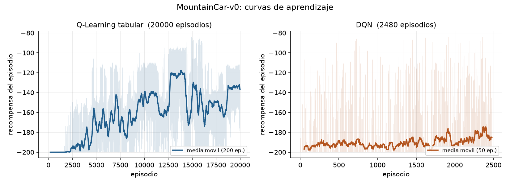

# Taller 1 — MountainCar-v0 con Q-Learning tabular y DQN

Gabriel Lizano Alvarado · Unidad 2 · Simulación y Aprendizaje por Refuerzo (EFMIA-SAPR20265)
Universidad de La Sabana · Maestría en Inteligencia Artificial

Implementación y comparación de dos enfoques sobre `MountainCar-v0`: un agente tabular con
discretización del espacio de estados y un agente de Deep Reinforcement Learning.

---

## Resultados

| Agente | Episodios | Recompensa media (10 evaluaciones) | Llega a la bandera |
| --- | --- | --- | --- |
| Q-Learning tabular | 20.000 | **-140,10** ± 8,06 | 10 / 10 |
| DQN | 2.480 | **-101,30** ± 5,10 | 10 / 10 |

El DQN supera el umbral convencional de -110 y también la referencia de -106 del repositorio
base. La evaluación es siempre con política codiciosa, sin exploración.



---

## Cómo ejecutarlo

El proyecto usa `uv` y requiere Python 3.11.

```bash
uv sync

uv run mountaincar train  qlearning --episodes 20000
uv run mountaincar load   qlearning --eval
uv run mountaincar render qlearning

uv run mountaincar train  dqn --episodes 2500
uv run mountaincar load   dqn --eval
```

Para entrenar guardando el historial de recompensas y poder graficar las curvas:

```bash
uv run python scripts/entrenar_con_historial.py qlearning 20000
uv run python scripts/entrenar_con_historial.py dqn 620     # repetir por tandas
uv run python scripts/graficar_curvas.py
```

El script de historial existe porque el entrenamiento se hizo por tandas: cada llamada carga
el agente guardado, entrena y anexa las recompensas al CSV. Así el estado sobrevive entre
ejecuciones.

---

## Q-Learning tabular

`MountainCar-v0` entrega una observación continua de dos dimensiones, posición y velocidad,
con cotas publicadas por el propio entorno. Se discretiza en una malla de 20 por 20, lo que
da 400 estados posibles; el agente entrenado visita 302 de ellos.

Tres piezas:

- **`discretize`** lleva cada dimensión a un índice de bin con `np.digitize` y devuelve una
  tupla de enteros, que es hashable y sirve de llave de la tabla Q.
- **`select_action`** es epsilon-greedy. Con `deterministic=True` nunca explora, que es el
  modo de evaluación y de renderizado.
- **`_update`** aplica la regla de diferencia temporal:

  ```
  objetivo   = recompensa + gamma * max_a' Q(s', a')
  Q(s, a)   += lr * (objetivo - Q(s, a))
  ```

  El detalle que importa es que el término futuro **solo se anula cuando `terminated` es
  verdadero**. Alcanzar el límite de 200 pasos es una truncación, no un estado terminal: el
  episodio se corta por reloj, no porque el mundo se acabe, así que ahí hay que seguir
  haciendo bootstrap. Confundir `terminated` con `done` sesga los valores hacia abajo.

Hiperparámetros: 20 bins por dimensión, tasa de aprendizaje 0,1, gamma 0,99, epsilon de 1,0 a
0,01 con decaimiento 0,9995.

---

## DQN

Red de tres capas, `estado(2) → 128 → 128 → acciones(3)`, con ReLU tras cada capa oculta y
sin activación en la salida, porque son valores Q y no probabilidades. Son 17.283 parámetros.

El paso de aprendizaje toma un lote de 64 transiciones del buffer de repetición y aplica la
actualización de Bellman:

- `current_q` sale de la red en línea, seleccionando con `gather` la acción que realmente se
  tomó.
- `next_q` sale de la **red objetivo**, bajo `torch.no_grad()`. Ese es justamente el punto de
  tener una red objetivo: que no fluya gradiente hacia el blanco.
- El objetivo es `r + gamma * next_q * (1 - terminated)`, con la misma distinción entre
  terminación y truncación que en el caso tabular.

Hiperparámetros: lr 0,001 con Adam, gamma 0,99, lote 64, buffer de 100.000 transiciones,
sincronización de la red objetivo cada 10 episodios.

---

## El problema de exploración, y cómo se diagnosticó

Con epsilon-greedy de manual el DQN reporta **-200 constante para siempre**. El código de
aprendizaje está bien; el problema es lo que esa estrategia de exploración puede alcanzar en
este entorno concreto.

El carro no tiene fuerza para subir la pendiente de frente. Necesita empujes **sostenidos** en
la misma dirección para acumular impulso. Si cada paso sortea una acción nueva e
independiente, la probabilidad de encadenar veinte empujes iguales es de aproximadamente
`(1/3)^20`, unas 3 en 10.000 millones. El agente nunca ve una recompensa distinta de -1, así
que no hay señal de la cual aprender.

En lugar de asumirlo, se midió. Cada estrategia se corrió 300 episodios **sin aprendizaje**,
contando cuántas veces se alcanzó la bandera:

| Estrategia de exploración | Éxitos / 300 | Recompensa media |
| --- | --- | --- |
| Uniforme, acción nueva en cada paso | **0** | -200,0 |
| Racha de 8 a 25 pasos | 35 | -194,4 |
| **Racha de 15 a 40 pasos** | **52** | -192,7 |
| Racha de 30 a 60 pasos | 33 | -193,9 |
| Racha de 50 a 90 pasos | 6 | -198,9 |
| Racha hasta que cambia el signo de la velocidad | 48 | -190,3 |

La exploración uniforme no llega a la bandera ni una sola vez. Rachas demasiado largas
tampoco sirven: con 50 a 90 pasos el agente empuja contra su propio movimiento y pierde el
impulso que ya llevaba. El óptimo está cerca del medio periodo de oscilación del carro.

**La corrección** mantiene la acción durante una racha de longitud aleatoria entre 15 y 40
pasos. Dos detalles que resultaron críticos:

1. **Una racha empezada se respeta hasta terminar.** La primera versión dejaba que un paso
   codicioso la cortara, y con epsilon intermedio las rachas se partían a los pocos pasos,
   así que el comportamiento volvía a ser prácticamente uniforme y el entrenamiento seguía
   plano en -200.
2. **La racha se reinicia al comenzar cada episodio**, para no arrastrar estado entre
   episodios.

También hubo que ajustar el decaimiento de epsilon. Con el valor por defecto de 0,995 epsilon
llega a su piso hacia el episodio 900, es decir que la exploración se agota antes de que el
agente aprenda nada. Se subió a **0,999**, que corre ese punto hasta cerca del episodio 4.600.

---

## Comparación de los dos métodos

**Desempeño final.** El DQN gana con claridad: -101,30 contra -140,10. La aproximación de
funciones generaliza entre estados vecinos, mientras que la tabla trata cada celda de la
malla como un problema independiente y necesita visitarlas todas.

**Estabilidad.** La desviación en evaluación es de 5,10 para el DQN y 8,06 para el
Q-Learning, pero la diferencia real es más grande de lo que sugieren esos números. Entrenar
de más **degrada** el Q-Learning: a 20.000 episodios da -138 y 10/10; continuando hasta
50.000 baja a -153; a 90.000 cae a -166 con solo 7 de 10. Con epsilon en su piso y tasa de
aprendizaje constante, los valores Q siguen oscilando sin converger. La varianza entre
corridas también es alta: la misma implementación con distinta semilla dio entre -136 y -176.

**Velocidad de aprendizaje.** En número de episodios el DQN es mucho más eficiente: 2.480
contra 20.000. En tiempo de reloj es al revés, porque cada paso del DQN implica una pasada
hacia adelante y hacia atrás por la red: unos diez minutos contra un minuto del tabular.

**Un detalle de lectura de las curvas.** La curva de entrenamiento del DQN se queda alrededor
de -185 mientras que su evaluación codiciosa da -101. No es contradicción: durante el
entrenamiento epsilon sigue alto y buena parte de los pasos son rachas de exploración, que
arruinan el episodio. La curva del Q-Learning sí sube hasta -135 porque su epsilon cae al
piso temprano y desde ahí entrena casi en modo codicioso. Comparar las dos curvas
directamente induce a error; lo comparable es la evaluación.

**Dificultad de implementación.** El Q-Learning son tres funciones cortas y la parte difícil
es conceptual, la distinción entre terminación y truncación. El DQN tiene más piezas móviles
(buffer, red objetivo, formas de los tensores), pero lo que de verdad costó no fue ninguna de
ellas: fue darse cuenta de que el algoritmo estaba bien y el problema era la exploración.

**Limitaciones.** El método tabular no escala: con dos dimensiones y 20 bins son 400 estados,
pero el crecimiento es exponencial en el número de dimensiones. El DQN escala, a cambio de
perder toda garantía de convergencia y de volverse sensible a hiperparámetros que en el caso
tabular no existen.

---

## Estructura del repositorio

```
src/mountain_car/
  agents/qlearning.py     Q-Learning tabular (ejercicio 1)
  agents/dqn.py           red, buffer, agente y exploración corregida (ejercicios 2 y 3)
  cli.py                  interfaz de línea de comandos
scripts/
  entrenar_con_historial.py   entrenamiento por tandas con registro en CSV
  graficar_curvas.py          curvas de aprendizaje
resultados/
  historial_qlearning.csv     recompensa por episodio
  historial_dqn.csv
  curvas_aprendizaje.png
saves/                     agentes entrenados
```
